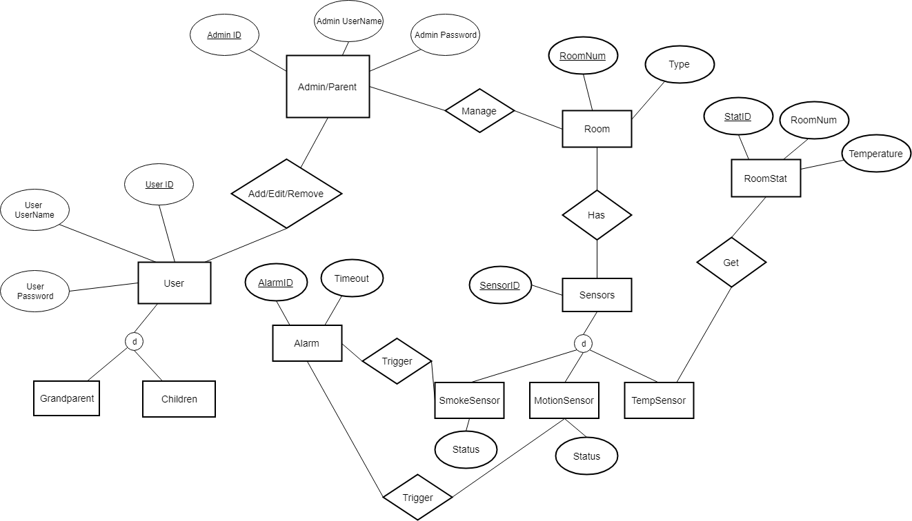
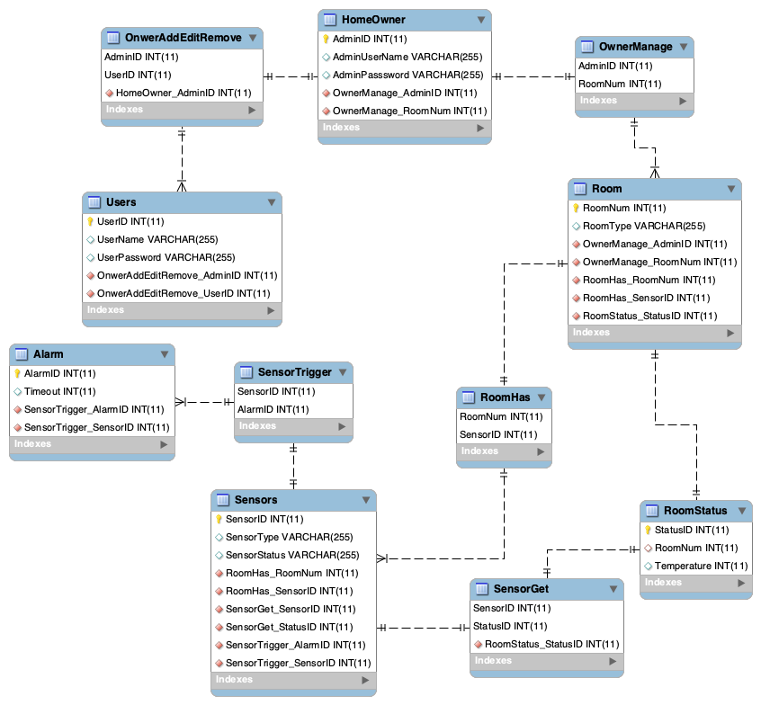

# Sprint 1 Design Document

## Deployment Environment

This tutorial works on Mac.

Create a Zephyr virtual environment. (Some of the downloads you will need may not work on your local machine without an environment due to other downloads you may already have & user preferences set).

Install Virtualenv  
`python3 -m pip install virtualenv`

Create environment called zephyr   
`python -m virtualenv zephyr`

Activate and enter VM  
`source zephyr/bin/activate`

You will need homebrew; get it here:  
https://brew.sh

install these tools with brew  
`brew install cmake ninja gperf ccache dfu-util qemu dtc python3`

You will need West, a Zephyr tool  
`pip3 install west`

Check your version and make sure it’s 0.5.0 or better  
`west --version`

Next, clone the Zephyr source code repositories from GitHub using the west tool you just installed.  
 `west init zephyrproject`  
 `cd zephyrproject`  
 `west update`

 Next, install additional Python packages required by Zephyr:  
 `pip3 install -r zephyr/scripts/requirements.txt`

This part can be done different ways by downloading different toolchains. Here is what works for setting the ZEPHYR_TOOLCHAIN_VARIANT.

Download the following toolchain by clicking ‘Downloads’:  
https://developer.arm.com/tools-and-software/open-source-software/developer-tools/gnu-toolchain/gnu-rm

Scroll down to **GNU Arm Embedded Toolchain: 7-2017-q4-major** and select. (This download has no known issues, whereas 2018 is still a bit buggy).

Scroll back up and download the Mac OS X 64-bit (This may take a minute)

Move the toolchain to home/opt (That is where Zephyr looks for toolchains by default):  
`mkdir -p "${HOME}"/opt`  
`cd "${HOME}"/opt`  
`tar xjf ~/Downloads/gcc-arm-none-eabi-7-2017-q4-major-mac.tar.bz2`  
`chmod -R -w "${HOME}"/opt/gcc-arm-none-eabi-7-2017-q4-major`

Now back to the zephyr environment. Navigate to the main project directory:  
`cd zephyrproject/zephyr`

Set up your build environment:  
`source zephyr-env.sh`

Build the application:  
`cd $ZEPHYR_BASE/samples/hello_world`  
`mkdir build && cd build`

Set toolchain variable  
`export GNUARMEMB_TOOLCHAIN_PATH='~/opt/gcc-arm-none-eabi-7-2017-q4-major/'`

Set Zephyr Variant  
`export ZEPHYR_TOOLCHAIN_VARIANT=gnuarmemb`

CMake a board of your choosing, qemu_cortex_m3 works with our toolchain and allows us to see visual output. (The board MUST be compatible with the toolchain we just downloaded, or else you will get an error when running this command):  
`cmake -GNinja -DBOARD=qemu_cortex_m3 ..`

Finally, run the ninja command  
`ninja run`

### File Management

We have decided to not deploy a database on a server, and rather save local files in the system. This will allow us to keep saved data in the system such as system settings and security pin.

## Functional Requirements

1. Smoke Detection Use Case
	- The users shall be able to activate and deactivate the smoke sensor.
	- The system shall display the specific location the smoke detected.
	- The home owner shall be able to manage the access level of family members.
	- The system shall be able to call 911 when no response from any user.
2. Access Detection Use Case		
	- The users shall be able to activate and deactivate the access sensor.
	- The home owner shall control the access sensor via simple control panel interface or detail Web interface, locally or remotely.
	- The system shall alarm when unauthorized access to the specific location (door or window) was detected.
	- Home owner can update his/her personal information and system’s password through control panel or web interface.

3. Temperature Control Use Case
	- The user should be able to set individual room temperatures.
	- The system will display current and user set temperatures based on temperature sensors placed in each room.
	- The user should be able to set the temperature to automatically change based on the time of day. 
	- The system will be able to display temperature control options based on the time of day.
	- The system will display system settings.
	- The user will be able to access the system settings to edit them such as system date.

## Database Design

### ERD

### DDL 

n/a

## Files that are stubbed out in your repository, with comments about the use cases they are connected to. These sections may not all exist for the Zephyr project teams. Simply explain them as best you can. 

### User Interface Files

1. SmartphoneInterface (The user interface of the system. It's connected to all three use cases: Access Detection, Smoke Detection, Temperature Controll)

### Model Files (Database Access)

1. MotionSensorModel (It's connected to Access Detection use case)
2. SmokeSensorModel (It's connected to Smoke Detection use case)
3. TemperatureModel (It's connected to Temperature Control use case)

### Controller Files (API or other)

1. MotionSensorController (It's connected to Access Detection use case)
2. SmokeSensorController (It's connected to Smoke Detection use case)
3. TemperatureController (It's connected to Temperature Control use case)

## Describe languages you need to use, and any gaps in skills on your team. 

1. first language 
    - C/C++
2. second language 
    - Python
3. Skill gaps, if any, otherwise specify who is doing what
    - Yongyu Deng working on Smoke Detection Use Case
    - Thomas Ertl working on Temperature Control Use Case
    - Wenbin Guo working on Access Detection Use Case
