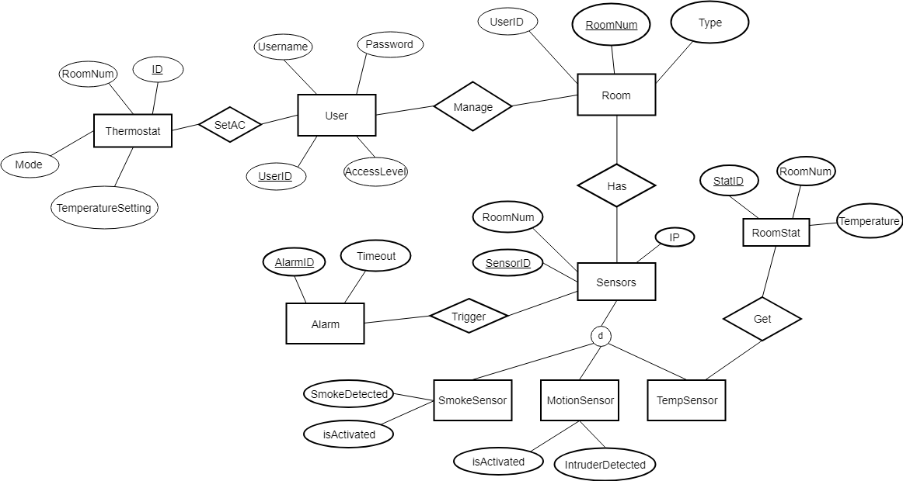
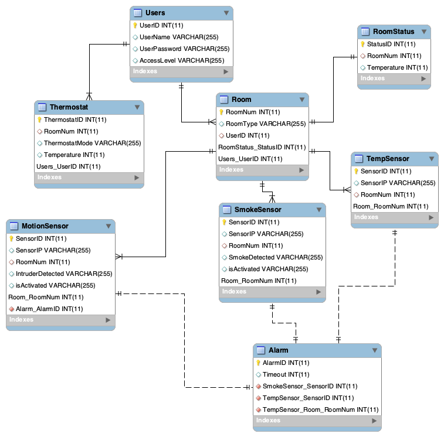
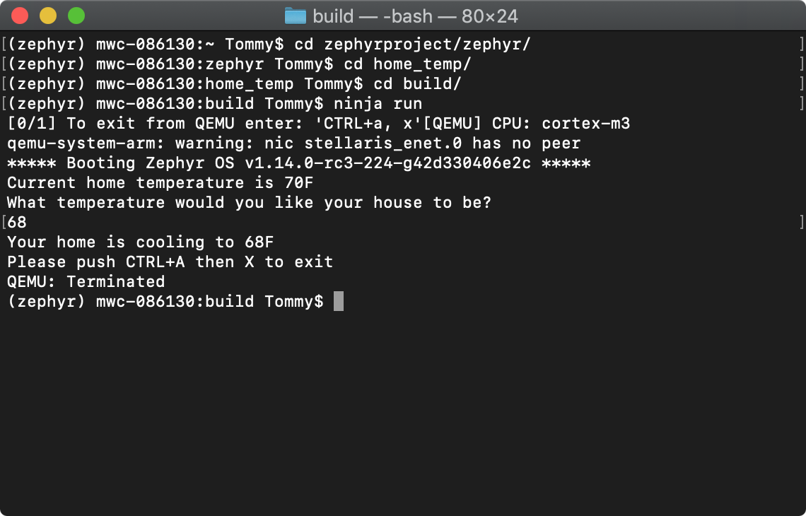

# Sprint 2
## Configuring instruction
To setup Zephyr, please head to [Sprint 1](https://github.com/computationalmystic/Zephyr-group12/blob/master/Sprint%201/Sprint%201%20design%20document.md)
	
Download our **home_temp folder** from this repository and then place it inside your main zephyr directory *User/zephyrproject/zephyr*.    
`git clone https://github.com/computationalmystic/Zephyr-group12.git`
	
Activate and Enter VM  
`source zephyr/bin/activate`
	
Now back to the zephyr environment. Navigate to the main project directory:    
`cd zephyrproject/zephyr`
	
Setup your bulid environment  
`source zephyr-env.sh`
	
Navigate to the previously downloaded Home_Temp folder and create a build directory  
`cd $ZEPHYR_BASE/home_temp`    
`mkdir build && cd build`
	
Set toolchain variable  
`export GNUARMEMB_TOOLCHAIN_PATH='~/opt/gcc-arm-none-eabi-7-2017-q4-major/'`
	
Set Zephyr Variant  
`export ZEPHYR_TOOLCHAIN_VARIANT=gnuarmemb`
	
CMake the board we used in the hello world example  
`cmake -GNinja -DBOARD=qemu_cortex_m3 ..`
	
Now run the program  
`ninja run`
	
	
## Board emulator
We will be using the qemu_cortex_m3 board for emulating on a MacOS environment.
It allows us to display and receive text from the user.

## Revised functional requirements
1. [Smoke Detection Use Case](https://github.com/computationalmystic/Zephyr-group12/blob/master/Use%20Cases/Smoke%20Detection%20Use%20Case.md)
	- The users shall be able to activate and deactivate the smoke sensor.
	- The system shall display the specific location the smoke detected.
	- The home owner shall be able to manage the access level of family members.
	- Children should have low access level, and when they try to deactivate any smoke sensor, it will be done only if parents get notified and approve the request.
	- The system shall be able to call 911 when no response from any user.
2. [Access Detection Use Case](https://github.com/computationalmystic/Zephyr-group12/blob/master/Use%20Cases/Access%20Detection%20Use%20Case.md)		
	- The users shall be able to activate and deactivate the access sensor.
	- The home owner shall control the access sensor via simple control panel interface or detail Web interface, locally or remotely.
	- The system shall alarm when unauthorized access to the specific location (door or window) was detected.
	- Home owner can update his/her personal information and system’s password through control panel or web interface.

3. [Temperature Control Use Case](https://github.com/computationalmystic/Zephyr-group12/blob/master/Use%20Cases/Temperature%20Control%20Use%20Case.md)
	- The user should be able to set individual room temperatures.
	- The system will display current and user set temperatures based on temperature sensors placed in each room.
	- The user should be able to set the temperature to automatically change based on the time of day. 
	- The system will be able to display temperature control options based on the time of day.
	- The system will display system settings.
	- The user will be able to access the system settings to edit them such as system date.
## Revised ERD


## What is necessary for your whole system to work
- Data sources: Temperature sensors data
- Functions: Set temperature

## Show clearly how the different software components communicate.
- The software will read in and display to the user temperature values from sensors placed throughout the home.
- The webpage and mobile app will allow the user to set and observe their home temperature.

## Mock up a full visual design
- [webpage](http://guowenbin.space/group12)
- 
- The web interface design is PC and mobile compatible. Users can manage and control the system remotely.
- 
## Coding
- [DDL](https://github.com/computationalmystic/Zephyr-group12/blob/master/ERD/Sprint2.sql)
```Mysql
Create Table Users(
UserID int not null,
UserName varchar(255),
UserPassword varchar(255),
AccessLevel varchar(255),
Primary key (UserID)
);

Create Table Room (
RoomNum int not null,
RoomType Varchar (255),
UserID int,
Foreign key (UserID) references Users(UserID),
primary key (RoomNum)
);

Create Table Thermostat(
ThermostatID int,
RoomNum int, 
ThermostatMode varchar(255),
Temperature int,
Foreign key (RoomNum) references Room(RoomNum),
primary key (ThermostatID)
);

Create Table SmokeSensor (
SensorID int not null,
SensorIP varchar(255),
RoomNum int,
SmokeDetected varchar(255),
isActivated varchar (255),
Foreign key (RoomNum) references Room(RoomNum),
Primary key (SensorID)
);

Create Table MotionSensor (
SensorID int not null,
SensorIP varchar(255),
RoomNum int,
IntruderDetected varchar(255),
isActivated varchar (255),
Foreign key (RoomNum) references Room(RoomNum),
Primary key (SensorID)
);

Create Table TempSensor (
SensorID int not null,
SensorIP varchar(255),
RoomNum int,
Foreign key (RoomNum) references Room(RoomNum),
Primary key (SensorID)
);

Create Table Alarm (
AlarmID int not null,
Timeout int,
Primary key (AlarmID)
);

Create Table RoomStatus (
StatusID int,
RoomNum int,
Temperature int,
Primary key (StatusID),
Foreign key (RoomNum) references Room(RoomNum)
);
```
- Dummy data
	- User
	
	UserID|UserName|UserPassword|AccessLevel
	|:--:|:------:|:----------:|:--------:|
	1|user1|123456|Admin
	2|user2|1234567|Children
	
	- ThermoStat
	
	ThermostatID|RoomNum|Mode|Temperature
	|:---------:|:-----:|:--:|:---------:|
	1|1|Cooling|72|
	
	- TempSensor
	
	SensorID|SensorIP|RoomNum
	|:-----:|:------:|:-----:|
	1|192.168.10.1|1
	
	- Room
	
	RoomID|Type|UserID
	|:---:|:--:|:----:|
	1|Bedroom|1
	
	- RoomStatus
	
	StatusID|RoomID|Temperature
	|:-----:|:----:|:---------:|
	1|1|80
	
	
	      
- [Prototype Code](https://github.com/computationalmystic/Zephyr-group12/blob/master/home_temp/src/main.c)
```C
/*
 * Copyright (c) 2017 Linaro Limited
 *
 * SPDX-License-Identifier: Apache-2.0
 */

#include <string.h>
#include <zephyr.h>
#include <misc/printk.h>
#include <console.h>
#include <stdio.h>
void store_temperature(const char *filepath, const char *data);
void get_current_temp(const char *filepath);
void main(void)
{
	console_getline_init();

    char *curTemp = "70";
    
    //curTemp = get_current_temp("Output.txt");
    
    printk("Current home temperature is %sF\n", curTemp);
	printk("What temperature would you like your house to be?\n");

    // Wait for user input then read house temp back to them.
	while (1) {
		char *s = console_getline();
        int i = atoi(s);
        
        //printk("Your home has been set to: %sF\n", s);
        if(i > 70)
        {
            printk("Your home is heating to %sF\n", s);
        }else if(i == 70)
        {
            printk("Your home is already at %sF\n", s);
        }
        else
            printk("Your home is cooling to %sF\n", s);
        
        printk("Please push CTRL+A then X to exit\n");
		//printk("last char was: 0x%x\n", s[strlen(s) - 1]);
        
        //store_temperature("Output.txt", "%s");
	}
    
   /* void store_temperature(const char *filepath, const char *data)
    {
        FILE *fp = fopen(filepath, "w");
        if (fp != NULL)
        {
            fputs(data, fp);
            fclose(fp);
        }
    }
    
    char get_current_temp(const char *filepath)
    {
        char *temp[255];
        
        FILE *fp = fopen(filepath, "r");
        if(fp != NULL)
        {
            fgets(temp, 255, (FILE*)fp);
            return temp;
        }
        else
        {
            return "70";
        }
    }*/
}
```
- Unit tests



## Testing

